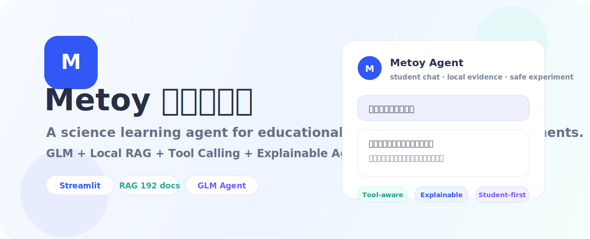

<p align="center">
  
</p>

<h1 align="center">Metoy 科学小导师</h1>

<p align="center">
  面向科学教具学习场景的轻量级 LLM Agent。让学生直接聊天学知识，也能基于真实教具说明书一步步做实验。
</p>

<p align="center">
  <a href="https://metoy-agent.onrender.com/"><b>Live Demo</b></a>
  ·
  <a href="docs/report_draft.md">Report Draft</a>
  ·
  <a href="docs/demo_script.md">Demo Script</a>
  ·
  <a href="DEPLOY.md">Deploy Guide</a>
</p>

<p align="center">
  
  
  
  
</p>

## Why Metoy

普通聊天机器人很会说，但教育场景里更重要的是：资料从哪里来、教具是不是真的存在、什么时候该讲知识点、什么时候才进入实验。Metoy 把这些判断拆成可解释的 Agent 流程，让学生端保持简单，让开发者端能看到依据。

## Highlights

| 能力 | 说明 |
| --- | --- |
| 学生聊天 | 像 ChatGPT 一样直接提问，支持知识讲解、追问和实验引导。 |
| 本地 RAG | 使用教材、论文和教具说明书构建 `192` 条本地知识片段。 |
| 教具目录工具 | 回答“有哪些教具”时只读取本地说明书，避免模型编造。 |
| 上下文记忆 | 支持“下一步”“怎么验证呢”“对第 2 种解释”等短追问。 |
| 开发者控制台 | 展示 Agent 架构、运行轨迹、RAG 依据和质量校验。 |
| 商店入口 | 可从 Agent 界面进入教具商店展示页，模拟真实产品场景。 |

## Demo Questions

```text
彩虹是怎么形成的？
你们有哪些教具？
我想用平面镜成像演示仪学习平面镜成像，请带我一步步做实验。
下一步呢？
怎么验证铁和棉花一样重？
```

## Architecture

```text
User Message
  -> Profile / State
  -> Memory Resolver
  -> Router
  -> Tool Registry
  -> Local RAG / Teaching Aid Catalog
  -> Reason / Experiment Design
  -> Safety Check
  -> GLM or Rule Generator
  -> Quality Verifier
  -> Student UI / Developer Console
```

## Local Run

```bash
python3 -m venv .venv
source .venv/bin/activate
pip install -r requirements.txt
cp .env.example .env
streamlit run app.py
```

Configure GLM in `.env`:

```bash
ZHIPU_API_KEY=your_zhipu_api_key
ZHIPU_MODEL=glm-4.5-air
```

Without `ZHIPU_API_KEY`, the app still runs with local rule fallback, but answers will be less natural.

## Data

The deployed app uses the compact processed knowledge base:

```text
data/edutoy/documents.jsonl
```

Raw PDFs and Word files are local-only source materials. They are not required for deployment.

## Deploy

This repo includes:

- `render.yaml` for Render Blueprint deployment
- `Dockerfile` for server deployment
- `.streamlit/config.toml` for Streamlit settings

Do not upload `.env`. Put `ZHIPU_API_KEY` in your deployment platform's environment variables.

## Project Story

See [docs/report_draft.md](docs/report_draft.md) for the course report draft and [docs/demo_script.md](docs/demo_script.md) for the presentation script.
